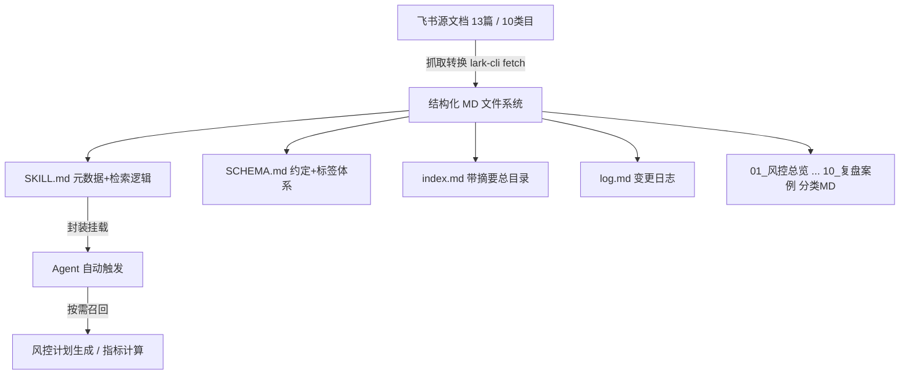

# 风控领域知识库(MD版)建设方案—AI执行说明书

> 来源：飞书文档 `docx: K2WUdXSlXowyadx1l28mJHVuyTe`（https://bytedance.my.larkoffice.com/docx/K2WUdXSlXowyadx1l28mJHVuyTe）
> 抓取转换日期：2026-08-12 ｜ 本文件由上述飞书原文转 MD 后覆盖旧版设计草案（旧版 v1 已废弃）。

---

> 📌 **本文档用途**：这是一份交付给「执行 AI」的施工说明书(Runbook)。执行 AI 应逐节阅读并按「六、执行步骤」落地，产出一套可被 agent 检索的风控 MD 知识库，用于提升风控计划生成与指标计算的准确性与完整度。
>
> **阅读对象**：具备文件读写、飞书文档抓取(lark-cli)、Skill 封装能力的 AI Agent。
>
> **设计范式**：Anthropic Agent Skills 的「渐进式披露」三层结构 + Andrej Karpathy「LLM Wiki」的持续编译式知识库范式，二者合并。

# 一、背景与目标

**背景**：现有一份飞书「风控领域知识库」索引页(docx token: RaEsd9K5Hop2Gjx7rSOlUJlQgyf)，它是一个 10 类目的分类框架，通过表格挂载了若干风控子文档。目前该索引仅是「链接聚合」，无法被 agent 直接检索利用。

**目标**：把这些飞书子文档抓取并转换为结构化 MD 文件，组织成一套 agent 可按类目/标签/指标名精准命中的知识库，并封装成 Skill 自动挂载到 agent。当 agent 执行「风控计划生成」「风控指标计算/口径查询」类任务时，自动召回相关知识作为参考。

**为什么不直接上向量 RAG**：Anthropic 在《Building effective agents》中建议「从最简方案起步，只在必要时增加复杂度；许多场景下单次 LLM 调用配合检索与 in-context examples 就已足够」[Building effective agents - Anthropic](https://www.anthropic.com/engineering/building-effective-agents)。当前源文档量级仅约 13 篇，实验研究亦表明 Agentic RAG 因额外推理步骤成本最高可达传统 RAG 的约 3.6 倍[Is Agentic RAG worth it? - arXiv](https://arxiv.org/html/2601.07711v1)。因此本方案采用「结构化 MD 文件 + 元数据路由」，预留 RAG 升级接口，文档量增至 50 篇以上再评估向量化。

# 二、方案总览:合并范式

本方案融合两套权威范式，取其互补优势：

## 2.1 Anthropic Agent Skills — 渐进式披露三层结构

Anthropic 官方将 Skill 定义为「一个包含 SKILL.md 的目录」，并采用「渐进式披露(progressive disclosure)」按需加载，以节省上下文[Agent Skills - Claude Docs](https://platform.claude.com/docs/en/agents-and-tools/agent-skills/overview)：

| 层级 | 加载时机 | 内容 |
|-|-|-|
| **Level 1 元数据** | 启动即常驻系统提示 | SKILL.md 的 YAML frontmatter(name + description)，让 agent 判断何时该用此 skill |
| **Level 2 指令** | 触发时加载(建议 5k token 以内) | SKILL.md 正文：工作流、检索逻辑、最佳实践 |
| **Level 3 资源** | 按需读取 | 附加 MD 文件、脚本、参考资料。SKILL.md 太大时应拆分为独立文件并按名引用 |

Anthropic 工程博客明确建议：「当 SKILL.md 变得臃肿时，把内容拆成独立文件并引用；互斥或极少同时使用的内容分开存放，可减少 token 占用」[Equipping agents with Agent Skills - Anthropic](https://www.anthropic.com/engineering/equipping-agents-for-the-real-world-with-agent-skills)。

## 2.2 Karpathy LLM Wiki — 持续编译式知识库

Karpathy 提出的 LLM Wiki 范式核心观点：传统 RAG 是「每次查询都从原始文档现场重新拼凑知识，毫无积累」，而 LLM Wiki 是「把知识预先编译成一套交叉引用的 markdown 文件并持续维护更新——知识编译一次并保持最新，而非每次查询重新推导」[Karpathy llm-wiki gist](https://gist.github.com/karpathy/442a6bf555914893e9891c11519de94f)。

其落地实现(Hermes Agent 版)给出可直接复用的三层目录与「会话开始先做定向(orientation)」机制：每次会话开始应先按序读取 SCHEMA.md、index.md、log.md(最近若干条)，以避免重复建页、漏交叉引用、违反既定约定[LLM Wiki skill - Hermes Agent](https://hermes-agent.nousresearch.com/docs/user-guide/skills/bundled/research/research-llm-wiki)。

## 2.3 合并后的整体架构



# 三、目录结构规范

知识库以 Skill 目录形式落地，合并两套范式后的目录如下。执行 AI 须严格按此结构创建。

```text
risk-knowledge-base/              # Skill 根目录
├── SKILL.md                      # L1+L2:元数据 + 触发时机 + 检索逻辑(必读入口)
├── SCHEMA.md                     # 分类体系 + frontmatter 约定 + 标签表(约定层)
├── index.md                      # 带一句话摘要的总目录(路由表)
├── log.md                        # 变更日志(append-only)
├── manifest.json                 # 机读元数据清单(供脚本/agent 快速过滤)
├── 01_风控总览/
│   ├── 国际支付账号体系介绍.md
│   ├── 3DS2.0分享.md
│   ├── PIPO支付风控核心指标口径OnePager.md
│   └── CheckPoint列表.md
├── 02_业务场景/
│   ├── GPP-电商业务线分享.md
│   ├── GPP-TikTokLive业务线分享.md
│   └── GPP-TikTokLocalService分享.md
├── 03_风险类型/
│   ├── TTS-ROW交易黑标V4.md
│   ├── TTS-ROW交易黑标V3.md
│   ├── 外链-D1xBdCDDnoq2.md
│   ├── 直播黑白标签定义与FP分析.md
│   └── 黑白标优化.md
├── 04_规则与策略/
│   └── 智能规则优化.md
├── 05_攻防对抗/                   # 预留空目录(源文档暂缺)
├── 06_模型建设/                   # 预留空目录
├── 07_平台能力/                   # 预留空目录
├── 08_监控运营/                   # 预留空目录
├── 09_合规治理/                   # 预留空目录
└── 10_复盘案例/                   # 预留空目录
```

> 💡 **落盘位置**：默认 `~/files/risk-knowledge-base/`(跨会话持久)。若最终要作为正式 Skill 挂载，再迁移到 agent 的 skill 目录。空类目保留占位，后续补文档直接放入。

# 四、每篇md的 Frontmatter Schema

每篇子文档转换后须为「YAML frontmatter 元数据 + 分节正文」。frontmatter 是 agent 路由与指标命中的关键——面向 agent 的知识库必须结构化，业界实践指出「结构化问题(如某口径是什么)靠纯全文检索答不好，答案是确定字段时必须给 KB 加结构化元数据」[Structured questions need structured KB](https://www.reddit.com/r/AI_Agents/comments/1t2j7bx/my_agent_struggles_answering_structured_questions/)。

```yaml
---
title: PIPO 支付风控核心指标口径 One Pager
category: 风控总览            # 必须是 10 类目之一
source_url: https://bytedance.sg.larkoffice.com/wiki/OKFhwkFROiiPEzkjw0Hc12tUnWg
source_token: OKFhwkFROiiPEzkjw0Hc12tUnWg
source_type: wiki            # wiki | docx | external
doc_type: 指标口径           # 指标口径 | 业务介绍 | 标签定义 | 规则策略 | 其他
tags: [支付风控, 指标, 口径, PIPO]
metrics: [拦截率, 误杀率, 交易成功率]   # 指标计算命中入口;无指标则留空 []
business_lines: [电商, 直播, LocalService]  # 涉及业务线;无则留空 []
summary: 一句话摘要,用于 index.md 路由,不超过 50 字
last_synced: 2026-08-12
---

## 适用场景
（这篇文档在什么情况下该被参考）

## 核心概念
（关键术语、定义）

## 关键指标口径
（指标计算最需要的部分,单独成节;逐条列出「指标名 = 口径定义 / 计算公式」）

## 规则 / 策略要点
（可执行的规则、阈值、判断逻辑）

## 原文正文
（保留完整正文,含表格;单主题、去除叙述性冗余）
```

> 💡 **内容形态要求**：遵循「单主题切块、事实前置、去除营销/叙述性 fluff」原则——面向人的长文 KB 会让 agent 抓到无关内容而答偏，面向 agent 的 KB 须一块一主题、事实前置[The RAG Playbook - Regal](https://www.regal.ai/blog/rag-playbook-structuring-knowledge-bases)。**「关键指标口径」节必须独立且逐条结构化**，这是本知识库服务「指标计算」场景的核心价值。

# 五、核心文件规范

## 5.1 SKILL.md(Skill 入口)

frontmatter 只放 name + description(Level 1,常驻)；正文放触发时机与检索逻辑(Level 2)。description 要写清「何时用」，让 agent 能自动判断触发。

```markdown
---
name: risk-knowledge-base
description: 风控领域知识库。当任务涉及风控计划生成、风控指标计算与口径查询、
  风险标签/规则/业务线相关问题时使用。覆盖支付风控、交易黑标、黑白标签、
  电商/直播/Local Service 业务线、智能规则等。
---

# 风控知识库检索指南

## 何时使用
- 生成风控相关计划、方案
- 计算或核对风控指标、查询指标口径定义
- 查询风险类型、黑白标签定义、规则策略

## 会话开始必做(orientation)
1. 读 SCHEMA.md 了解分类与标签约定
2. 读 index.md 了解现有文档及摘要
3. 读 log.md 最近 20 条了解最新变更

## 检索流程
1. 从任务中抽取:类目 / 指标名 / 业务线 / 关键词
2. 读 manifest.json,按 category / metrics / business_lines / tags 过滤命中文档
3. 打开命中 MD,优先读「关键指标口径」「规则/策略要点」节
4. 将命中的口径定义、规则要点作为参考注入主流程,并标注来源文档

## 注意
- 引用知识时必须标注来源 MD 与 source_url,不得臆造口径
- 未命中时如实说明,不要编造
```

## 5.2 SCHEMA.md(约定层)

定义：10 类目的定义与边界、frontmatter 字段规范、tags 受控词表(避免同义词发散)、doc_type 枚举、命名规范。这是维护一致性的「宪法」，新增文档必须遵守。

## 5.3 index.md(路由目录)

分类树 + 每篇一行摘要(取自 frontmatter 的 summary)，供快速定位。示例行：`- [PIPO支付风控核心指标口径](01_风控总览/PIPO支付风控核心指标口径OnePager.md) — 支付风控核心指标的统一口径定义`。

## 5.4 log.md(变更日志)

append-only，记录每次抓取/更新：`[2026-08-12] 初始化,导入 13 篇,建立 10 类目`。用于会话 orientation 时快速了解最近动作。

## 5.5 manifest.json(机读清单)

把所有 MD 的 frontmatter 汇总成一个 JSON 数组，每个元素含 title/path/category/tags/metrics/business_lines/summary/source_url。agent 或脚本无需逐个打开 MD 即可过滤，是检索的快速索引。

# 六、执行步骤(给执行 AI 的操作指令)

严格按阶段推进，每阶段完成后自检再进入下一阶段。

## 阶段 0:准备

1. 创建目录 `~/files/risk-knowledge-base/` 及 10 个类目子目录。
2. 读取源索引文档(docx: RaEsd9K5Hop2Gjx7rSOlUJlQgyf)，核对下表「七、源文档清单」的 token 是否一致。

## 阶段 1:抓取与转换(逐篇)

1. 对「七、源文档清单」中每一篇，用 lark-doc skill 的 `docs +fetch --api-version v2 --doc <token> --doc-format markdown` 抓取正文。
2. 按「四、Frontmatter Schema」把正文整理成结构化 MD，重点提炼「关键指标口径」「规则/策略要点」两节。
3. 写入对应类目目录，文件名与「三、目录结构」保持一致。
4. **外链处理**：风险类型下的 `bytedance.my.larkoffice.com/docx/D1xBdCDDnoq2lyxLXnjmpPycyvV` 无标题，先尝试抓取；若跨租户无权限，则在 MD 中记录 URL 与「待补权限」状态，不阻塞其余文档。
5. 每篇转换后追加一条 log.md 记录。

## 阶段 2:构建索引与约定文件

1. 汇总所有 MD 的 frontmatter，生成 manifest.json。
2. 生成 index.md(分类树 + 每篇摘要)。
3. 编写 SCHEMA.md(类目定义 + 字段规范 + tags 受控词表)。
4. 编写 SKILL.md(按 5.1 模板)。

## 阶段 3:封装与挂载

1. 将 `risk-knowledge-base/` 作为 Skill 目录挂载到 agent(见「八、挂载方式」)。
2. 用 2-3 个典型问题验证触发与召回(见「九、验收标准」)。

# 七、源文档清单

以下为源索引页(RaEsd9K5Hop2Gjx7rSOlUJlQgyf)中实际挂载的文档。执行 AI 抓取时以此为准。

| 类目 | 文档标题 | 类型 | token / 链接 |
|---|---|---|---|
| 风控总览 | 国际支付账号体系介绍 GP Account System Introduction | wiki | SOBvwqWBwiUhSBkEmdZc8PECnVr |
| 风控总览 | 3DS2.0分享 | docx | EaSEd2RBHo5m4RxTHuIlVkgjgEb |
| 风控总览 | PIPO 支付风控核心指标口径 One Pager | wiki | OKFhwkFROiiPEzkjw0Hc12tUnWg |
| 风控总览 | CheckPoint列表 | wiki | NCnrwffXLiuObhkXU3jcw5oln2e |
| 业务场景 | GPP-电商业务线分享 E-commerce Introduction | wiki | BS4owO25UicSLEk8vc6cEKk6n5f |
| 业务场景 | GPP-TikTok Live业务线分享 | wiki | ACYSwba3RiKyahkkcrAcxVx1nLb |
| 业务场景 | GPP-TikTok Local Service Sharing | wiki | XRxwwwQA2ifnSgkc6qrc2rZanzd |
| 风险类型 | TTS ROW交易黑标V4 | docx | NdvHda7wdoYg2pxIP3imRObVyKd |
| 风险类型 | TTS ROW交易黑标V3 | docx | NoxLdl168odBR1xzDLElYbtZgyc |
| 风险类型 | (外链,无标题) | external | bytedance.my.larkoffice.com/docx/D1xBdCDDnoq2lyxLXnjmpPycyvV |
| 风险类型 | 直播黑白标签定义和 False Positive 分析 | docx | EW59dcy88osQ3vxud6mlbJCfg1z |
| 风险类型 | 黑白标优化 | wiki | FPe7wZWupi25jNkWrWuchKLYnUf |
| 规则与策略 | 智能规则优化 | docx | PJnEd8NvqooFXYxDWE8lrlzBgoh |
| 攻防对抗 / 模型建设 / 平台能力 / 监控运营 / 合规治理 / 复盘案例 | (源索引中暂无文档) | — | 预留空类目 |

# 八、挂载与调用方式

| 方式 | 做法 | 适用 |
|-|-|-|
| **方式1:Skill 封装(推荐)** | 目录含 SKILL.md,agent 启动加载其 name+description,任务匹配时自动触发,按检索流程召回 | 与现有 agent skill 体系一致,自动触发,可平滑升级 RAG |
| 方式2:目录约定 + 检索脚本 | 固定路径 + search_kb.py 按 metric/business 过滤返回命中 MD | 不想建 skill、快速验证阶段 |
| 方式3:全量注入 | 把 index.md + 高频正文拼进上下文 | 仅文档极少的临时方案,吃 token |

# 九、验收标准

- [ ] 10 个类目目录全部创建,含 6 个预留空目录
- [ ] 12 篇内部文档全部抓取转换成功(外链 1 篇按权限情况处理并标注状态)
- [ ] 每篇 MD 均含合规 frontmatter(category/tags/metrics/business_lines/summary/source_url 齐全)
- [ ] 含指标的文档均有独立且逐条结构化的「关键指标口径」节
- [ ] SCHEMA.md / index.md / log.md / manifest.json / SKILL.md 五个核心文件齐备
- [ ] manifest.json 与实际 MD 文件一一对应,无遗漏无冗余
- [ ] 用「电商场景误杀率口径」「直播黑白标签定义」等典型问题验证,能正确命中对应 MD
- [ ] 引用知识时能标注来源 MD 与 source_url

# 十、防幻觉

- 禁止臆造指标口径、阈值、规则：所有指标定义必须来自源文档原文，无则留空并标注「源文档未提供」。
- 禁止编造 source_url / token：必须来自「七、源文档清单」或实际抓取结果。
- 抓取失败或无权限时如实记录状态，不得用推测内容填充。
- tags 必须使用 SCHEMA.md 受控词表，不得随意造词导致检索发散。
- 禁止把面向人的营销性/叙述性冗余原样搬入，须做单主题、事实前置的精简。

# 十一、参考

- [Agent Skills - Claude Platform Docs](https://platform.claude.com/docs/en/agents-and-tools/agent-skills/overview) — Skill 结构与渐进式披露三层机制
- [Equipping agents with Agent Skills - Anthropic Engineering](https://www.anthropic.com/engineering/equipping-agents-for-the-real-world-with-agent-skills) — SKILL.md 拆分与按需引用最佳实践
- [Building effective agents - Anthropic Engineering](https://www.anthropic.com/engineering/building-effective-agents) — 从最简方案起步的原则
- [Karpathy llm-wiki gist](https://gist.github.com/karpathy/442a6bf555914893e9891c11519de94f) — LLM Wiki 持续编译式知识库范式(思想)
- [LLM Wiki skill - Hermes Agent](https://hermes-agent.nousresearch.com/docs/user-guide/skills/bundled/research/research-llm-wiki) — 三层目录与 orientation 机制(工程落地)
- [The RAG Playbook - Regal](https://www.regal.ai/blog/rag-playbook-structuring-knowledge-bases) — 面向 agent 的 KB 单主题切块与事实前置
- [Structured questions need structured KB](https://www.reddit.com/r/AI_Agents/comments/1t2j7bx/my_agent_struggles_answering_structured_questions/) — 结构化问题需结构化元数据
- [Is Agentic RAG worth it? - arXiv](https://arxiv.org/html/2601.07711v1) — Agentic RAG 成本约为传统 RAG 的 3.6 倍
